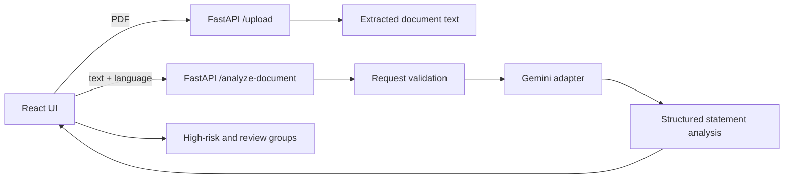
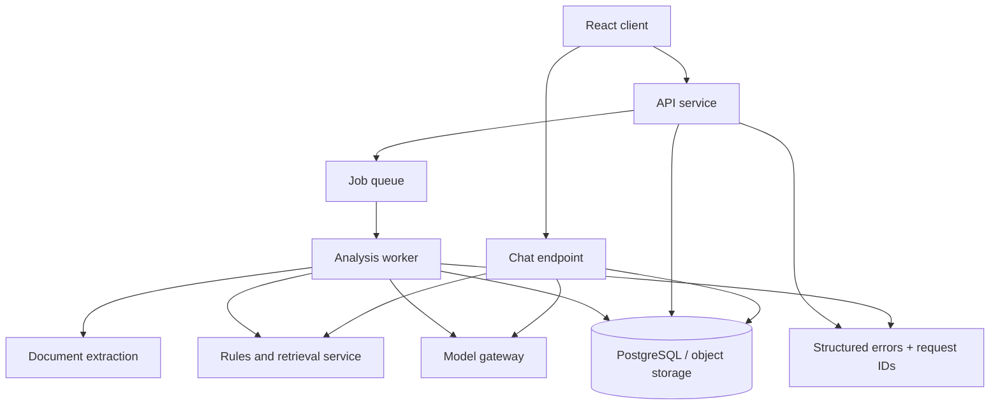

# ClearClause Architecture

## Current request flow



The active analysis contract is `POST /analyze-document`:

```json
{
  "text": "document text",
  "language": "English"
}
```

The response contains a summary, disclaimer, and every detected statement with `statement`, `risk_rating`, `explanation`, and `flag`. The UI groups the response by risk and puts Red statements first.

## Production target



## Reliability rules

1. Keep API keys server-side only. Load them from environment or a secret manager; never expose them to React or commit `.env`.
2. Validate file type, size, extracted text length, and request body before model calls.
3. Use a model gateway with timeouts, bounded exponential retry for 429/503, model fallback, and a circuit breaker. Do not retry invalid keys, malformed requests, or 404 model errors.
4. Return stable error JSON such as `{ "code": "MODEL_UNAVAILABLE", "message": "...", "request_id": "..." }` and let the UI show a retry action.
5. Persist documents and analysis jobs with status values `queued`, `processing`, `complete`, and `failed`; the browser should poll or subscribe to job status instead of holding a long request open.
6. Store the original document separately from extracted text and generated analysis. Add retention and deletion controls because documents may contain personal data.
7. Treat model output as untrusted input: validate against the response schema, normalize risk values, and reject incomplete statements.
8. Keep legal rules in a versioned knowledge base. Every Yellow or Red result should retain the rule source and knowledge-base version used to produce it.
9. Add health endpoints for API, database, model configuration, and queue. Add structured logs, request IDs, latency metrics, retry counts, and error-rate alerts.
10. Test the API contract, PDF extraction, empty and oversized inputs, model timeout, rate-limit, invalid-key, malformed-model-output, and end-to-end high-risk rendering paths.

## Repository ownership

- `frontend/src/App.tsx`: request state, response validation, and user-visible errors.
- `frontend/src/components/ClauseCard.tsx`: risk-group presentation.
- `backend/main.py`: HTTP boundary, validation, CORS, and upload handling.
- `backend/clause_analyzer_poc.py`: Gemini adapter and structured-output validation.
- `backend/chat_engine.py`: currently an isolated chat experiment; it should be moved behind a `/chat` service contract only after its model configuration and dependency are made explicit.

The current system is a synchronous MVP. It now presents all statement risks and degrades with an actionable API error, but no external model can be guaranteed to be available always. Queueing, persistence, fallback models, and observability are the pieces needed for production uptime.
